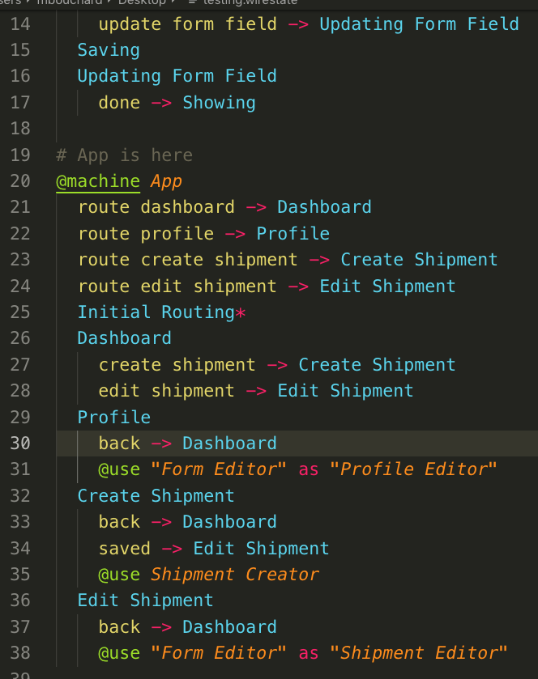

# WireState for Visual Studio Code

This extension provides syntax highlighting for the WireState markup language,
as well as allowing you to easily open the associated callback file from the
wirestate file itself. Additionally, the `callbacks/index.js` that maintains
the various `require` statements for each callback is now automatically maintained.

## Quick Start

Git clone the project into a folder of your choosing. In this example, we are
cloning it into your home folder under the `wirestate-vscode/` directory.

```
$ git clone https://github.com/launchfort/wirestate-vscode.git ~/wirestate-vscode
$ cd ~/wirestate-vscode
$ npm install
$ ln -s ~/wirestate-vscode ~/.vscode/extensions/wirestate-vscode
```

Make sure to reload VS Code for the changes to be applied.

## Features



## Known Issues

N/A

## Release Notes

### 2.0.0

You're now able to put your cursor on any of the machine/state nodes, then
// right-click and choose "Manage WireState callback..." (or key shortcut Cmd+Alt+/).
It will open the correct callback file, or create one for you if not there already (won't save to disk until you choose to, so it's easy to just close without committing to it).

Additionally, when you save or delete a callback file, the callbacks/index.js
will automatically maintain the necessary require statement for you.

### 1.0.0

Initial release of WireState syntax highlighting

## References

- https://code.visualstudio.com/api/language-extensions/syntax-highlight-guide
- 12.4 Naming Conventions at https://macromates.com/manual/en/language_grammars